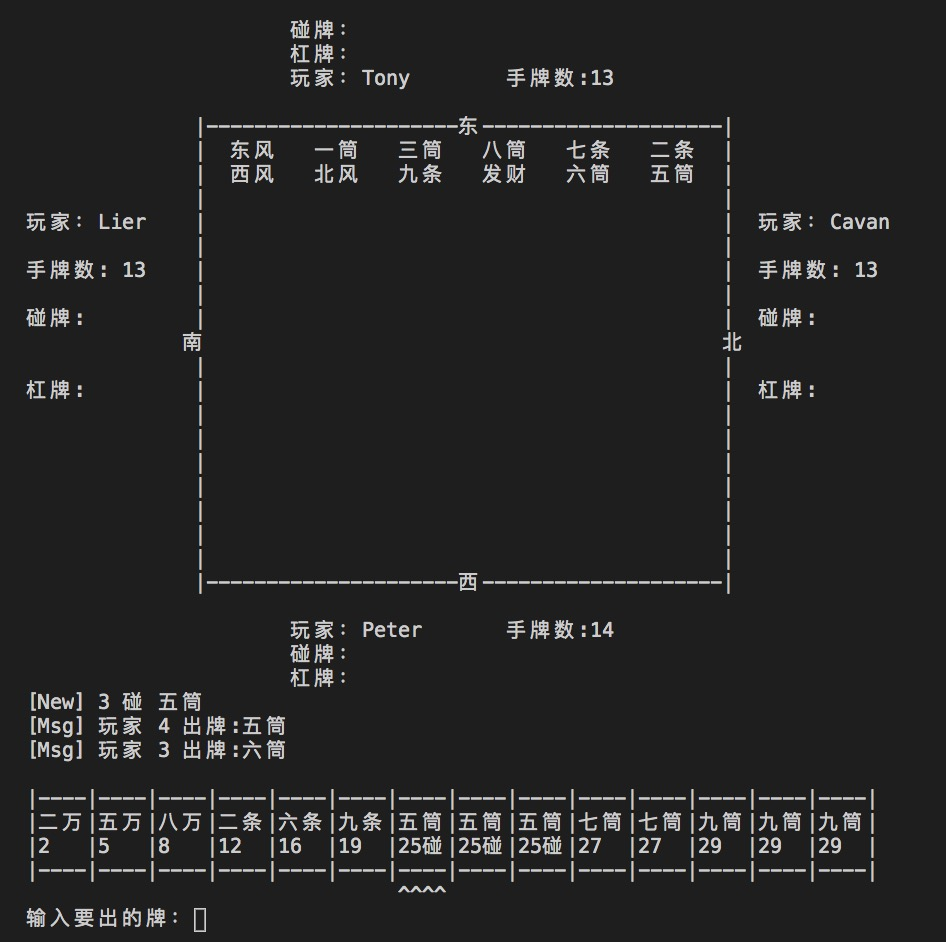
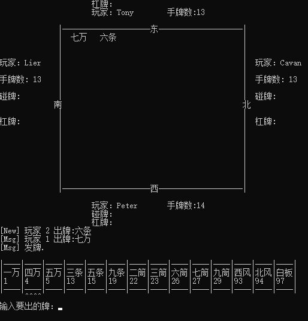
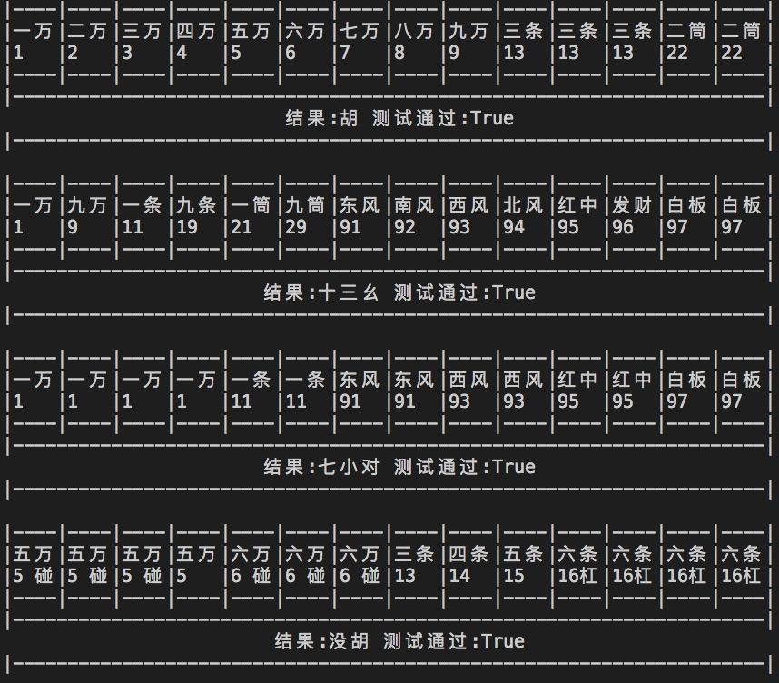
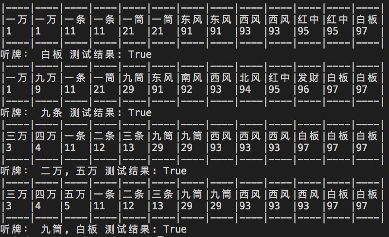

## 前言
本来我并不喜欢打麻将，也不会打，过年被老婆拉去凑数之后，发现麻将这个游戏还挺有意思的，不断地算牌得出最容易胡牌的组合。从老家回来，疫情爆发，也没办法线下组织麻将活动，在手机上打了一段时间，有人问我，做这个游戏需要多久，思考了下，不考虑UI表现的话，3，4小时吧。对方不信，遂有了这个小游戏，还赠送他一个命令后UI

## 规则
做任何事情之前，都要有一个准备，要去搞懂这个要做的事情的规则是怎么样的，提前规划好模块和功能，才能事半功倍。

### 广东麻将的规则

- 胡牌规则分3种情况
  1. 只有一对相同牌型的牌，剩余的牌型都是123，111，1111 这样的情况
  2. 14个牌，可以组成7对
  3. 一筒，九筒，一条，九条，一万，九万，东南西北中发白

- 胡牌牌型: 
    - 123 为 顺子
    - 111 为 3个相同的牌，刻子
    - 1111 为 杠，如果不杠，放在牌堆里，则不能使用1111表示
    - 00 为 一对牌
    - 0 为单独一个牌

   -  其中杠牌“1111”，就当作“111”看待，如果有4个相同的不杠，那就不能算是“111”
       - 00,123,123,123,123
       - 00,123,123,123,111
       - 00,123,123,111,111
       - 00,123,111,111,111
       - 00,111,111,111,111
       - 00,00,00,00,00,00,00
       - 一筒，九筒，一条，九条，一万，九万，东南西北中发白, 0

- 牌型：
    - 万条饼
    - 东西南北风
    - 中发白

## 功能划分

可以把整个游戏分为3个部分
1. 胡牌检查
2. 碰，杠 检查
3. 听牌检查

只要实现以上3个功能，麻将游戏基本完成了80%
所以就从这3个功能开始入手

## 牌桌
  有了以上的功能，麻将的玩法基本已经足够了，但是真正可以打牌的话。还是需要一个牌桌，这个牌桌的功能如下：
  - 洗牌
  - 发牌
  - 回合控制
  - 胜负判断

代码就不单独展示了，效果如下：

## 测试结果

